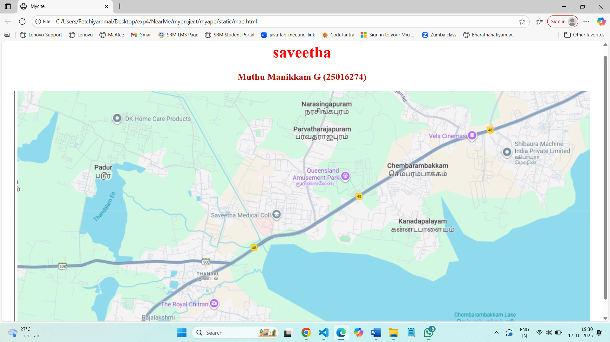

# Ex04 Places Around Me
## Date: 17/10/2025

## AIM
To develop a website to display details about the places around my house.

## DESIGN STEPS

### STEP 1
Create a Django admin interface.

### STEP 2
Download your city map from Google.

### STEP 3
Using ```<map>``` tag name the map.

### STEP 4
Create clickable regions in the image using ```<area>``` tag.

### STEP 5
Write HTML programs for all the regions identified.

### STEP 6
Execute the programs and publish them.

## CODE
<<<<<<< HEAD
=======
```
>>>>>>> e138b96 (Success)
map.html
<!DOCTYPE html>
<html lang="en">
<head> 
     <title>Mycite</title>
</head>
<body>
    <h1 align="center">
    <font color="red"><b>saveetha</b></font>
        </h1>
        <h3 align="center">
            <font color="bule"><b>Muthu Manikkam G (25016274)</b></font>
        </h3>
    <center>
        
   <map name="Mycity">
    <area shape="rect" coords="100,100,900,900" href="home.html" title="my home town">
   </map>
    </center>
</body>
</html>

padur.html
<!DOCTYPE html>
<html lang="en">
<head>
    <meta charset="UTF-8">
    <meta name="viewport" content="width=device-width, initial-scale=1.0">
    <title>Document</title>
</head>
<body>
    
</body>
</html>

queensland.html
<!DOCTYPE html>
<html lang="en">
<head>
    <meta charset="UTF-8">
    <meta name="viewport" content="width=device-width, initial-scale=1.0">
    <title>Document</title>
</head>
<body>
    
   
</body>
</html>

hospital.html
<!DOCTYPE html>
<html lang="en">
<head>
    <meta charset="UTF-8">
    <meta name="viewport" content="width=device-width, initial-scale=1.0">
    <title>Document</title>
</head>
<body>
    
    
</body>
</html>
```

## OUTPUT


## RESULT
The program for implementing image maps using HTML is executed successfully.
